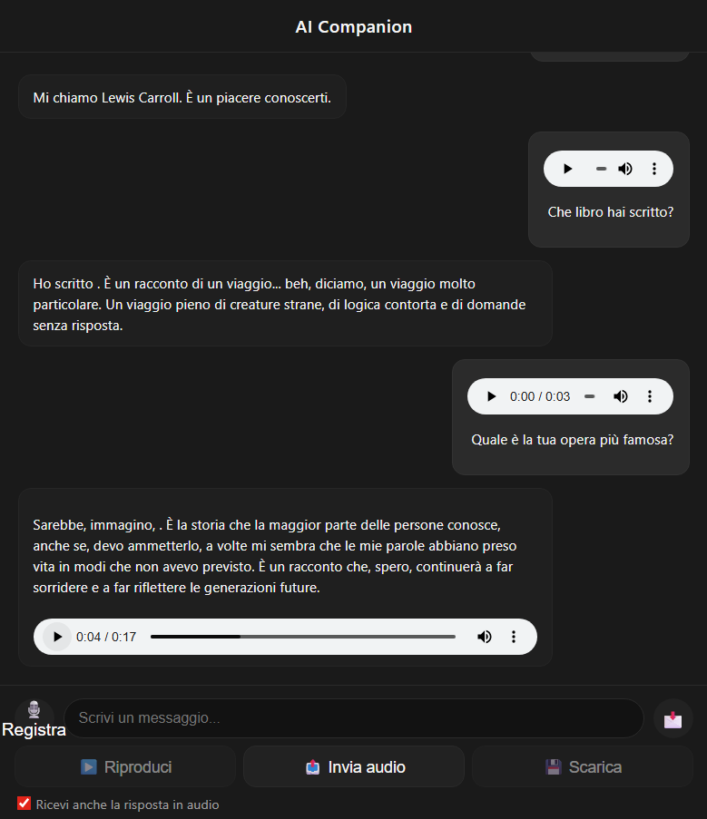
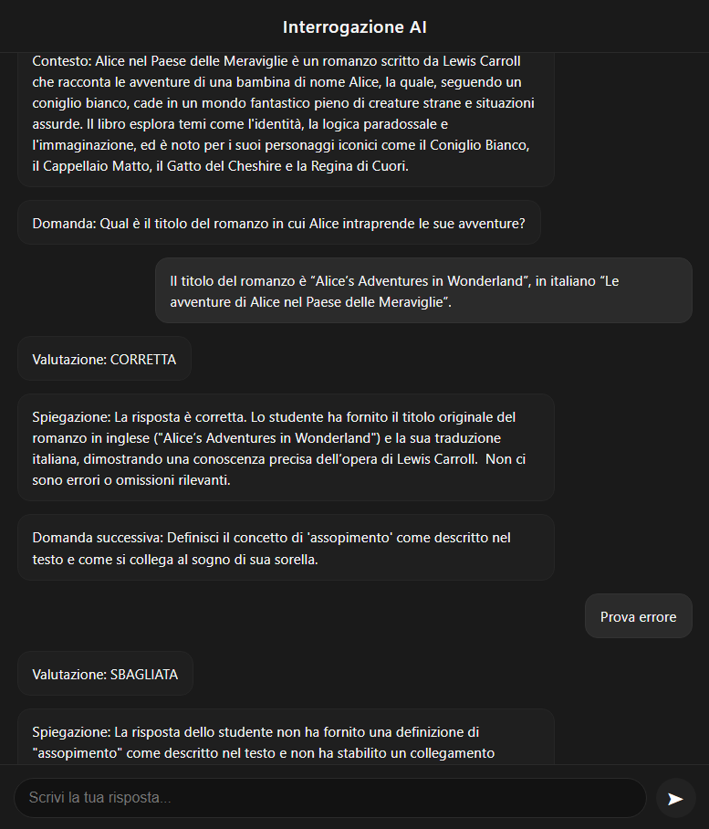

# Screenshot – AIcompanion

Questa pagina raccoglie e descrive tutte le schermate principali dell’interfaccia utente di **AIcompanion**, incluse la modalità Chat e la modalità Interrogazione.  
Le immagini sono state catturate dall’interfaccia web realizzata in Flask e ottimizzata per desktop.

### aicompanion.py - Chat Bot interattiva:
File: **[aicompanion.py](../aicompanion.py)**

Interfaccia principale usata per dialogare con l’assistente AI tramite messaggi **testuali** o **audio**.

Funzionalità:
- Area chat
- Input text e pulsante audio
- Gestione TTS (risposte vocali)
- Integrazione ASR (Whisper) per input vocali
- Stile semplice e leggibile

### aicompanion_test.py- Chat Bot interrogazione:
File: **[aicompanion_test.py](../aicompanion_test.py)**

Interfaccia dedicata alla generazione e valutazione automatica delle risposte.

Funzionalità:
- Domanda corrente generata dal sistema
- Campo risposta studente
- Valutazione automatica (✔ CORRETTA / ✘ SBAGLIATA)
- Spiegazione dettagliata fornita dal modello
- Gestione sessione + riepilogo finale

